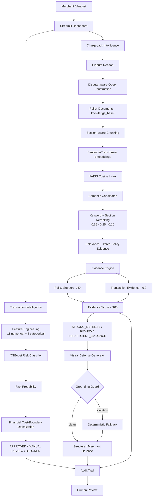
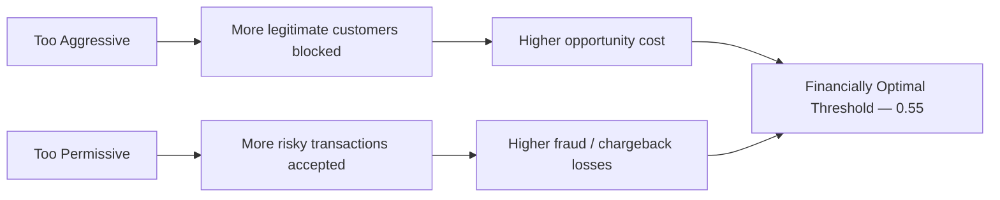
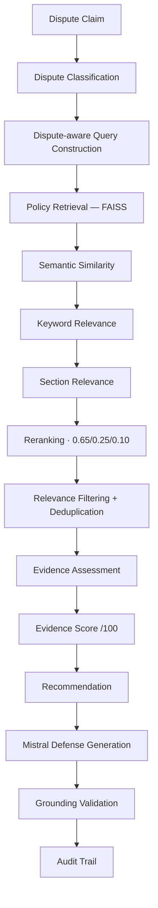

# 🛡️ HORAЕ

### AI-Powered Chargeback Intelligence & Merchant Risk Defense

> From transaction risk scoring to policy-grounded dispute defense — Horae turns merchant risk operations into an explainable, evidence-driven intelligence pipeline.

[](https://www.python.org/)
[](https://streamlit.io/)
[](https://xgboost.readthedocs.io/)
[](https://github.com/facebookresearch/faiss)
[](https://www.sbert.net/)
[](https://mistral.ai/)
[](#razorpay-buildathon-positioning)

Built for the **Razorpay Buildathon 2026 — AI Risk Manager Track**.

---

## Table of Contents

1. [The Problem](#the-problem)
2. [The Core Idea](#the-core-idea)
3. [Key Metrics](#key-metrics)
4. [System Architecture](#system-architecture)
5. [Risk Intelligence Engine](#risk-intelligence-engine)
6. [Financial Cost Optimization](#financial-cost-optimization)
7. [Chargeback Intelligence Pipeline](#chargeback-intelligence-pipeline)
8. [Policy RAG Engine](#policy-rag-engine)
9. [RAG Retrieval Evaluation](#rag-retrieval-evaluation)
10. [Chargeback Evidence Engine](#chargeback-evidence-engine)
11. [AI Defense Generator](#ai-defense-generator)
12. [Explainability & Audit Trail](#explainability--audit-trail)
13. [Human-in-the-Loop](#human-in-the-loop)
14. [Streamlit Dashboard](#streamlit-dashboard)
15. [Technology Stack](#technology-stack)
16. [Repository Structure](#repository-structure)
17. [Live Demo Case — TXN_200481](#live-demo-case--txn_200481)
18. [Setup](#setup)
19. [Environment Variables](#environment-variables)
20. [Building the RAG Index](#building-the-rag-index)
21. [Security & Responsible AI](#security--responsible-ai)
22. [Limitations](#limitations)
23. [Why Horae](#why-horae)
24. [Engineering Philosophy](#engineering-philosophy)
25. [Future Roadmap](#future-roadmap)

---

## The Problem

Merchants face two connected, unsolved operational problems.

**Transaction risk isn't binary.** Blocking every suspicious transaction sounds safe, but aggressive blocking creates false positives — lost revenue, checkout friction, and abandoned legitimate customers. Being too permissive creates real fraud, return, and chargeback losses. The real question isn't *"is this transaction fraudulent?"* — it's:

> **What action minimizes expected financial loss while protecting legitimate customers?**

**Chargeback response is fragmented.** When a dispute is raised, a merchant must determine what evidence exists, what's missing, which policy clause applies, whether that evidence actually supports their position, and how to write a coherent, defensible response — usually by manually cross-referencing transaction records, shipping data, and refund policy documents.

Horae addresses both as a single intelligence layer rather than two disconnected tools.

---

## The Core Idea

Horae is an **AI risk decision + chargeback defense intelligence layer**, not a fraud-blocking black box. It is explicitly **defensive by design** — it does not attempt to exploit payment systems, automate payment retries, evade controls, or manipulate payment networks.

```
TRANSACTIONS  →  RISK  →  DISPUTES  →  MANUAL INVESTIGATION      (today)
TRANSACTIONS  →  INTELLIGENCE  →  EVIDENCE  →  DECISION  →  DEFENSE   (Horae)
```

Two pipelines, one system:

**Transaction risk pipeline**
```
Transaction → XGBoost risk score → Financial cost optimization → APPROVED / MANUAL REVIEW / BLOCKED
```

**Chargeback defense pipeline**
```
Dispute claim → Policy RAG (FAISS + rerank) → Evidence Engine → Mistral defense generator → Merchant decision
```

---

## Key Metrics

Every number below is pulled directly from the checked-in dataset, model metadata, and evaluation harness in this repository.

| Metric | Value |
|---|---|
| Synthetic transaction records | **60,000** |
| RAG evaluation scenarios | **5** dispute types |
| Internal retrieval accuracy | **5 / 5 (100%)** — top-1 section match |
| Policy support scoring (max) | **40 points** |
| Transaction evidence scoring (max) | **60 points** |
| Total evidence score | **100 points** |
| Optimal risk threshold (trained) | **0.55** (probability) |
| High-value human-review threshold | **> ₹10,000** |
| Optimal net financial value (test set) | **₹11,799,888.17** |

> These are internal engineering metrics from the checked-in synthetic dataset and evaluation harness — not production benchmarks. See [Limitations](#limitations).

---

## System Architecture



---

## Risk Intelligence Engine

**`src/train.py`** trains an `XGBClassifier` on the 60,000-row synthetic transaction dataset (`data/synthetic_transactions.csv`), generated by `src/generator.py`.

**Features actually used by the model** (`models/model_metadata.json`):

| Numerical | Categorical |
|---|---|
| `account_age_days` | `item_category` |
| `past_orders_count` | `device_type` |
| `past_return_count` | `payment_method` |
| `past_return_rate` | |
| `order_amount_inr` | |
| `profit_margin_inr` | |
| `chargeback_fee_inr` | |
| `transaction_hour` | |
| `zip_delta_km` | |
| `address_mismatch` | |
| `velocity_15min` | |

Categorical features are one-hot encoded; numerical features are median-imputed inside a scikit-learn `ColumnTransformer` + `Pipeline`. The classifier itself:

```python
XGBClassifier(
    n_estimators=400, learning_rate=0.05, max_depth=4,
    min_child_weight=2, subsample=0.85, colsample_bytree=0.85,
    objective="binary:logistic", eval_metric="logloss",
)
```

The model produces a **risk probability**, not a verdict:

```
RAW FEATURES → XGBOOST → RISK PROBABILITY → COST-OPTIMIZED DECISION
```

Standard classification metrics (accuracy, precision, recall, F1, ROC-AUC) are computed at a 0.50 threshold in `evaluate_model()`, but the **operating threshold used in production is 0.55** — selected by financial optimization, not by maximizing these metrics. See below.

---

## Financial Cost Optimization

Horae does not pick a risk threshold by maximizing accuracy. It picks the threshold that **maximizes net financial value** on the transaction set, using each transaction's actual `profit_margin_inr` and `chargeback_fee_inr`.

```
NET VALUE =
    (profit margin preserved on correctly allowed transactions)
  − (profit margin lost on incorrectly blocked legitimate transactions)
  + (profit margin + chargeback fee avoided on correctly caught risk)
  − (profit margin + chargeback fee lost on missed risk)
```

`optimize_threshold()` in `src/train.py` sweeps thresholds from `0.05` to `0.96` in steps of `0.01`, computes `net_value_inr` at each, and keeps the maximizer. On the trained model this converged to a threshold of **0.55**, with a best net value of **₹11,799,888.17** on the held-out test set — both values are recorded in `models/model_metadata.json`.



At inference time (`app.py`), a transaction's risk label is derived from this threshold and its 0.55×-scaled midpoint for a `MEDIUM` band:

```
risk_probability ≥ threshold        → HIGH
risk_probability ≥ threshold × 0.55 → MEDIUM
else                                 → LOW
```

`HIGH` risk becomes `BLOCKED`, **unless** the order is above ₹10,000 — in which case it is routed to `MANUAL REVIEW` instead of an autonomous block (see [Human-in-the-Loop](#human-in-the-loop)).

---

## Chargeback Intelligence Pipeline



---

## Policy RAG Engine

**`src/rag_engine.py`** implements RAG v2.1 over the four policy documents in `knowledge_base/` (`refund_policy.txt`, `return_policy.txt`, `shipping_policy.txt`, `terms_of_service.txt`).

```
Policy .txt files (knowledge_base/)
        ↓
Section-aware chunking  (headings like "2. ITEM NOT RECEIVED" detected and preserved)
        ↓
sentence-transformers/all-MiniLM-L6-v2 embeddings
        ↓
FAISS IndexFlatIP (cosine similarity via L2-normalized vectors)
        ↓
Dispute-aware query enrichment
        ↓
Top-8 semantic candidates
        ↓
Keyword + section-hint reranking
        ↓
Relevance filtering + deduplication
        ↓
Final evidence (max 3 chunks)
```

Persisted artifacts: `models/rag/policy.index` (FAISS index) and `models/rag/chunks.npy` (chunk metadata, including `source`, `section_index`, `section_title`, `text`).

**Why plain vector search isn't enough.** A naive cosine-similarity search can retrieve text that is superficially similar but belongs to the wrong policy section. Horae's `rerank_result()` blends three signals into a single reranked score:

```
reranked_score = 0.65 × semantic_similarity
               + 0.25 × keyword_overlap
               + 0.10 × section_hint_match
```

Each dispute type (`ITEM_NOT_RECEIVED`, `PRODUCT_DEFECTIVE_OR_SWAPPED`, `UNAUTHORIZED_TRANSACTION`, `SUBSCRIPTION_CANCELLED_REFUND`, `NOT_AS_DESCRIBED`) has its own curated keyword list and section-hint list (`DISPUTE_KEYWORDS`, `DISPUTE_SECTION_HINTS`) used to compute these signals.

Results are then labeled by relevance band (`HIGH ≥ 0.70`, `MEDIUM ≥ 0.50`, `LOW ≥ 0.40`, else `FILTERED`), deduplicated on normalized text, and capped at 3 final chunks.

**RAG never decides the outcome of a dispute.** It only surfaces grounded, source-attributed policy evidence — the Evidence Engine remains responsible for scoring the case.

---

## RAG Retrieval Evaluation

`src/rag_engine.py` includes a lightweight regression suite (`evaluate_retrieval`), not a production-scale benchmark, checking whether each dispute type's top-ranked retrieval lands in the expected policy section:

| Dispute Type | Expected Section Match | Result |
|---|---|---|
| `ITEM_NOT_RECEIVED` | ITEM NOT RECEIVED | ✅ |
| `PRODUCT_DEFECTIVE_OR_SWAPPED` | PRODUCT DEFECT | ✅ |
| `UNAUTHORIZED_TRANSACTION` | UNAUTHORIZED TRANSACTIONS | ✅ |
| `SUBSCRIPTION_CANCELLED_REFUND` | SUBSCRIPTION CANCELLATION | ✅ |
| `NOT_AS_DESCRIBED` | PRODUCT NOT AS DESCRIBED | ✅ |

**RAG Retrieval Accuracy: 5 / 5 (100%)**

This confirms that the top-1 reranked chunk belongs to the policy section that should govern that dispute type, over the current 4-document corpus. It is an internal correctness check on this checked-in policy set, not a claim about retrieval quality at production scale or across a larger corpus.

---

## Chargeback Evidence Engine

**`src/evidence_engine.py`** is deterministic — it does not call an LLM. It combines retrieved policy evidence with synthetic operational transaction evidence (`src/transaction_evidence.py`) against dispute-specific rule sets (`DISPUTE_RULES`).

```
DISPUTE REASON + TRANSACTION + RETRIEVED POLICY
        ↓
Policy Support Score  (keyword coverage of retrieved text)   → max 40
        ↓
Transaction Evidence Score  (per-dispute weighted checks)    → max 60
        ↓
Evidence Score = Policy Support + Transaction Evidence        /100
        ↓
STRONG_DEFENSE (≥75) / REVIEW (≥50) / INSUFFICIENT_EVIDENCE (<50)
```

Each dispute type has its own weighted checklist. For example, `ITEM_NOT_RECEIVED` checks:

| Check | Weight |
|---|---|
| Carrier delivery confirmation available | 25 |
| Proof of delivery available | 20 |
| Shipping address verified | 15 |

**`src/transaction_evidence.py`** simulates deterministic operational records (tracking numbers, fulfillment/delivery timestamps, delivery status, authentication status, subscription/refund status, etc.) using a stable SHA-256 hash of the transaction ID as a seed — the same transaction always produces the same synthetic evidence. It is explicitly documented in-code as a **synthetic evidence layer for the hackathon dataset**, not a claim to represent real payment or shipping records.

This layered design keeps the LLM from ever independently inventing the merchant's position — the score, the recommendation, and the underlying facts are all computed before the language model is invoked.

---

## AI Defense Generator

**`src/defense_generator.py`** turns a scored case into a structured, professional chargeback response using **Mistral** (`mistral-small-latest`), with a **deterministic fallback** when no API key is configured or when the LLM output fails validation.

```
generate_defense(case)
        ↓
MISTRAL_API_KEY present?
   ├── No  → generate_fallback_defense()                (template-based, always available)
   └── Yes → Mistral chat.complete (temperature=0.1)
                  ↓
             JSON parsed + required-field check
                  ↓
             validate_defense_grounding()
                  ├── violation  → generate_fallback_defense()
                  └── clean      → structured defense returned
```

The system prompt explicitly constrains the model:

> *"Never invent evidence. Never invent tracking numbers. Never invent delivery confirmation... If evidence is missing, explicitly state that it is missing. Do not exaggerate the strength of the merchant's case."*

**Grounding is enforced in code, not just in the prompt.** `validate_defense_grounding()` checks the generated draft against the verified evidence packet:

- If delivery was **not** confirmed, the draft is rejected if it contains phrases like `"successfully delivered"` or `"proof of delivery confirms"`.
- Any `TRK_` tracking number mentioned in the draft must exactly match the verified synthetic tracking number.
- Any `TXN_` transaction ID mentioned must exactly match the case's transaction ID.

If a violation is detected, Horae discards the LLM output and falls back to the deterministic generator — so the system degrades to a safe, templated response rather than to an ungrounded one.

Output schema (identical for both the LLM and fallback paths):

```json
{
  "case_summary": "...",
  "merchant_position": "...",
  "supporting_evidence": [],
  "missing_evidence": [],
  "recommended_action": "...",
  "draft_defense": "..."
}
```

**Separation of concerns:**

| Layer | Responsibility |
|---|---|
| RAG | Retrieves grounded policy evidence |
| Evidence Engine | Scores the case deterministically |
| Mistral / fallback | Synthesizes the final written response only |

---

## Explainability & Audit Trail

Horae exposes the components of every decision rather than a single opaque score:

- Risk probability and derived risk level (`HIGH` / `MEDIUM` / `LOW`)
- Evidence score, broken down into policy support (/40) and transaction evidence (/60)
- Matched policy keywords and per-check evidence breakdown (pass/fail + weight)
- Retrieval diagnostics: semantic / keyword / section scores, relevance label, candidates filtered
- Recommended action and generation mode (`Mistral` vs `Deterministic fallback`)

**On feature attribution:** Horae's dashboard is explicit that SHAP-style per-feature importance is **not implemented** in the checked-in backend. Instead of fabricating attribution values, the **Risk Analytics** page shows an actual feature-level trigger matrix (velocity spikes, address mismatch, new-account + high-value, off-peak hour, etc.) computed directly from the dataset.

Every completed chargeback assessment is appended to a session-scoped **audit trail** (`append_audit_event`, `Audit Trail` page) capturing:

```json
{
  "timestamp": "...",
  "transaction_id": "...",
  "model_version": "horae-risk-v1",
  "risk_score": 0.0,
  "decision": "APPROVED | MANUAL REVIEW | BLOCKED",
  "evidence_score": 0.0,
  "policy_sources": ["refund_policy.txt", "..."],
  "retrieval_diagnostics": {},
  "financial_impact": {
    "order_amount_inr": 0.0,
    "profit_margin_inr": 0.0,
    "chargeback_fee_inr": 0.0
  },
  "recommendation": "STRONG_DEFENSE | REVIEW | INSUFFICIENT_EVIDENCE",
  "dispute_reason": "...",
  "generation_mode": "Mistral | Deterministic fallback",
  "recommended_action": "..."
}
```

The trail is exportable as JSON from the dashboard (`horae_audit_trail.json`). It is currently held in Streamlit session state, not a persistent database — see [Limitations](#limitations).

```
INPUT → MODEL → DECISION → EVIDENCE → EXPLANATION → AUDIT LOG
```

---

## Human-in-the-Loop

Horae treats model probability as a strong signal, not an unchallengeable verdict. High-value transactions are deliberately **not** auto-blocked:

```python
scored["action"] = np.select(
    [
        (risk_level == "HIGH") & (order_amount_inr > 10000),
        (risk_level == "HIGH"),
    ],
    ["MANUAL REVIEW", "BLOCKED"],
    default="APPROVED",
)
```

Any high-risk transaction above **₹10,000** is routed to `MANUAL REVIEW` instead of `BLOCKED`. The dashboard states this design choice directly: *"Horae optimizes economic consequence, not accuracy alone. Orders above ₹10,000 are surfaced as manual review when risk is high."*

```
MODEL → RISK / EVIDENCE SCORE → DECISION POLICY → HUMAN REVIEW WHEN REQUIRED → FINAL OPERATIONAL DECISION
```

AI assists the decision. It does not replace accountable review.

---

## Streamlit Dashboard

`app.py` is a single-file Streamlit application structured as a merchant risk command center with seven workspace views:

| Page | Purpose |
|---|---|
| **Command Center** | KPI overview — net revenue protected, transactions analyzed, high-risk volume, margin retained |
| **Risk Analytics** | Model signals, threshold behavior, feature-level trigger matrix |
| **Transaction Ledger** | Search, filter, and inspect individual synthetic records |
| **Chargeback Defense** | Run a full case end-to-end: retrieve policy → assess evidence → generate defense |
| **Evidence & RAG** | Inspect retrieval diagnostics — semantic / keyword / section scores per chunk |
| **Audit Trail** | Session-scoped, exportable decision history |
| **System** | Read-only status of the risk engine, RAG engine, and defense engine |

Visual direction: dark charcoal surfaces, a fintech-orange accent, rounded panel cards, and a dense analytical layout modeled on fintech infrastructure dashboards rather than a generic chat UI. The sidebar surfaces live engine health (`ONLINE` / `UNAVAILABLE`) for the risk engine, RAG engine, and defense engine based on whether the relevant model/index files are present on disk.

---

## Technology Stack

| Layer | Technology |
|---|---|
| Frontend | Streamlit |
| Language | Python 3.14 |
| ML — Risk Model | XGBoost (`XGBClassifier`), scikit-learn (`Pipeline`, `ColumnTransformer`, `OneHotEncoder`, `SimpleImputer`) |
| ML — Data | NumPy, Pandas, Joblib |
| RAG — Embeddings | Sentence-Transformers (`all-MiniLM-L6-v2`) |
| RAG — Vector Index | FAISS (`faiss-cpu`, `IndexFlatIP`) |
| Generative AI | Mistral API (`mistralai`, `mistral-small-latest`) |
| Config | `python-dotenv` |
| Explainability / Audit | Structured JSON logging + rule-based feature trigger matrix (no SHAP in the checked-in backend) |
| Environment | `uv`, Python `>=3.14`, `torch` / `torchvision` (Sentence-Transformers backend) |

Dependency list is sourced directly from `pyproject.toml`.

---

## Repository Structure

```
Horae/
│
├── app.py                        # Streamlit dashboard — 7-page merchant command center
├── main.py                       # End-to-end CLI pipeline demo (TXN_200481)
├── pyproject.toml                # Dependencies (uv-managed)
├── .python-version                # Python 3.14
│
├── src/
│   ├── generator.py               # Synthetic 60,000-row transaction dataset generator
│   ├── train.py                   # XGBoost training + financial threshold optimization
│   ├── rag_engine.py              # Chunking, embeddings, FAISS index, rerank, RAG evaluation
│   ├── evidence_engine.py         # Deterministic policy + transaction evidence scoring
│   ├── transaction_evidence.py    # Deterministic synthetic operational evidence generator
│   └── defense_generator.py       # Mistral defense generation + grounding validation + fallback
│
├── data/
│   └── synthetic_transactions.csv # 60,000 synthetic transaction records
│
├── models/
│   ├── risk_model.pkl             # Trained XGBoost pipeline (joblib)
│   ├── model_metadata.json        # Model version, features, optimal threshold, financial result
│   └── rag/
│       ├── policy.index           # FAISS index
│       └── chunks.npy             # Chunk metadata (source, section, text)
│
└── knowledge_base/
    ├── refund_policy.txt
    ├── return_policy.txt
    ├── shipping_policy.txt
    └── terms_of_service.txt
```

---

## Live Demo Case — TXN_200481

The exact scenario hard-coded in `main.py` and used as the default case in the Streamlit dashboard.

```
┌─────────────────────────────────────┐
│ TXN_200481                          │
│ ₹18,500 · Electronics · UPI         │
│ ITEM_NOT_RECEIVED                   │
├─────────────────────────────────────┤
│ Policy Match (retrieved)     ✓      │
│ Shipping Address Verified    ✓      │
│ Carrier Delivery Confirmation ✕     │
│ Proof of Delivery             ✕     │
├─────────────────────────────────────┤
│ Policy Support     · up to 40       │
│ Transaction Evid.  · up to 60       │
│ Recommendation: REVIEW (typical)    │
└─────────────────────────────────────┘
```

**What happens, step by step:**

1. **Transaction** — a ₹18,500 Electronics order, 240-day-old account, 18 past orders, disputed as `ITEM_NOT_RECEIVED`.
2. **RAG retrieval** — the query *"Customer claims that their package was not received"* is embedded, searched against the FAISS index, and reranked; the `ITEM NOT RECEIVED` section of `refund_policy.txt` surfaces as top evidence.
3. **Evidence assessment** — `src/transaction_evidence.py` deterministically generates synthetic delivery evidence for this transaction ID (address verified; delivery confirmation and proof of delivery are evidence-dependent and vary by transaction). The Evidence Engine scores policy support (/40) and transaction evidence (/60).
4. **Recommendation** — `STRONG_DEFENSE`, `REVIEW`, or `INSUFFICIENT_EVIDENCE`, depending on the resulting score.
5. **Defense generation** — Mistral (or the deterministic fallback) drafts a case summary, merchant position, supporting/missing evidence lists, a recommended action, and a full draft defense letter — grounded strictly in the evidence computed above.

Horae never hard-codes a win. The system is intentionally conservative: if delivery confirmation is missing, it says so, and routes the case toward review rather than overstating the merchant's position.

Run it yourself:

```bash
uv run python main.py
```

---

## Setup

```bash
git clone <repo-url>
cd Horae

# Install dependencies (uv-managed project, Python >=3.14)
uv sync
```

Generate the synthetic dataset and train the risk model (first run only — `data/`, `models/risk_model.pkl`, and `models/model_metadata.json` are already checked in, but this reproduces them):

```bash
uv run python src/generator.py
uv run python src/train.py
```

Build the RAG index (see [Building the RAG Index](#building-the-rag-index) — `models/rag/policy.index` and `models/rag/chunks.npy` are already checked in):

```bash
uv run python src/rag_engine.py
```

Run the end-to-end CLI pipeline:

```bash
uv run python main.py
```

Launch the dashboard:

```bash
uv run streamlit run app.py
```

> A live deployment of the dashboard is available at: https://93yycpccyidrf2jqxdb66a.streamlit.app/

---

## Environment Variables

| Variable | Required | Purpose |
|---|---|---|
| `MISTRAL_API_KEY` | No | Enables Mistral-generated chargeback defenses. Without it, `generate_defense()` transparently uses the deterministic fallback generator — the system remains fully functional. |

Loaded via `python-dotenv` (`load_dotenv()` in `src/defense_generator.py`). Never commit `.env` to source control — it is already excluded in `.gitignore`, alongside a `.env.example` allowance for a template file. Configure the key through your deployment platform's secret manager in production.

---

## Building the RAG Index

```
knowledge_base/*.txt
        ↓
load_policy_documents()      — load all .txt files
        ↓
chunk_text()                 — section-aware chunking (700-char chunks, 100-char overlap,
                                numbered headings like "2. ITEM NOT RECEIVED" detected)
        ↓
load_embedding_model()        — sentence-transformers/all-MiniLM-L6-v2
        ↓
build_faiss_index()            — L2-normalized embeddings → IndexFlatIP (cosine similarity)
        ↓
save_index()                   — persists models/rag/policy.index + models/rag/chunks.npy
```

Rebuild and evaluate the index:

```bash
uv run python src/rag_engine.py
```

Running the module directly builds the index (if not cached) and runs the retrieval regression suite (`test_retrieval()` → `evaluate_retrieval()`), printing per-case diagnostics and the final `5/5` accuracy summary described above.

---

## Security & Responsible AI

- API keys are never committed to source control (`.env` is git-ignored).
- `MISTRAL_API_KEY` is entirely optional — the deterministic fallback keeps the system demoable and functional without any external LLM dependency.
- Generated defenses are validated against verified evidence (`validate_defense_grounding`) before being surfaced; ungrounded output is discarded in favor of the fallback.
- The system is explicitly defensive: no offensive payment exploitation, no automated payment-retry abuse, no credential attacks, no evasion logic.
- High-value, high-risk cases are routed to human review rather than autonomous action.
- No formal compliance certifications are claimed.

---

## Limitations

Stated plainly, in the spirit of an engineering handoff rather than a pitch deck:

- The transaction dataset is **synthetic**, generated by a hand-tuned latent risk formula (`src/generator.py`) — it is not real merchant or payment-network data.
- The policy corpus currently contains **4 documents**; RAG evaluation reflects correctness on this specific corpus, not a production-scale benchmark.
- Transaction-level "evidence" (tracking numbers, delivery timestamps, authentication status, etc.) used by the Evidence Engine is **deterministically synthesized** per transaction ID for demonstration — it is explicitly documented in-code as not representing real payment or shipping records.
- Mistral-based defense generation depends on an external API and is optional; the fallback path is templated rather than generative.
- The Sentence-Transformers embedding model must be downloaded on first run (network access required).
- The audit trail is held in Streamlit session state — it is not currently backed by a persistent database.
- `main.py` imports a `search_policy` function from `src.rag_engine`; the current `rag_engine.py` exposes `retrieve_evidence` / `retrieve_with_diagnostics` instead (this is what `app.py` uses). Running `main.py` as-is will fail on this import until `search_policy` is added or the import is updated.
- No real payment-network or merchant production-system integration exists.

---

## Why Horae

| Capability | Traditional Workflow | Horae |
|---|---|---|
| Risk assessment | Manual review or static rules | XGBoost probability + financial cost optimization |
| Decision threshold | Fixed / accuracy-tuned | Threshold selected to maximize net financial value |
| Policy retrieval | Manual document search | Dispute-aware FAISS retrieval with rerank |
| Evidence analysis | Ad hoc, inconsistent | Deterministic, weighted, per-dispute-type scoring |
| Defense drafting | Written from scratch each time | LLM-generated, grounded in verified evidence, with a fallback |
| Explainability | Opaque judgment calls | Score breakdowns, retrieval diagnostics, generation mode |
| Auditability | Scattered across tools/emails | Structured, exportable audit events |
| Human review | All-or-nothing | High-value risk explicitly routed to review, not auto-blocked |

---

## Engineering Philosophy

Horae is built around four principles:

1. **Evidence over assumptions** — every defense claim traces back to a verified evidence field or policy chunk.
2. **Financial cost over raw accuracy** — the risk threshold is chosen to maximize net monetary value, not F1 score.
3. **Explainability over black-box automation** — every score is decomposed into its constituent parts, and unimplemented explainability (e.g. SHAP) is labeled as such rather than faked.
4. **Human oversight over blind autonomy** — high-value, high-risk decisions are routed to a human, not executed automatically.

---

## Razorpay Buildathon Positioning

Built for the **Razorpay Buildathon 2026 — AI Risk Manager Track**. This is not an official Razorpay product and claims no formal endorsement.

The relevance: large-scale digital payment ecosystems like Razorpay's carry proportionally large exposure to transaction risk and chargeback complexity. Horae demonstrates one architectural approach to that problem — combining a cost-aware risk classifier with a grounded, auditable chargeback defense pipeline — as a self-contained, fully reproducible reference implementation.

---

## Future Roadmap

Clearly future work — none of the following exists in the current codebase:

- Real merchant payment-gateway integrations
- Real-time transaction streaming instead of batch CSV scoring
- Richer behavioral feature stores (session-level, cross-merchant signals)
- Larger, multi-merchant policy corpora
- Hybrid retrieval evaluation against a held-out benchmark set
- Automated evidence ingestion from shipping/carrier and payment-gateway APIs
- Merchant-specific policy indexes (multi-tenant RAG)
- SHAP-based (or equivalent) per-feature model attribution
- Production-grade observability and model/calibration monitoring
- Persistent, database-backed audit storage with retention policies
- Human-review feedback loops back into model retraining
- Network-level dispute analytics across merchants

---

<p align="center"><sub>HORAЕ · Razorpay Buildathon 2026 · Synthetic demo environment</sub></p>
